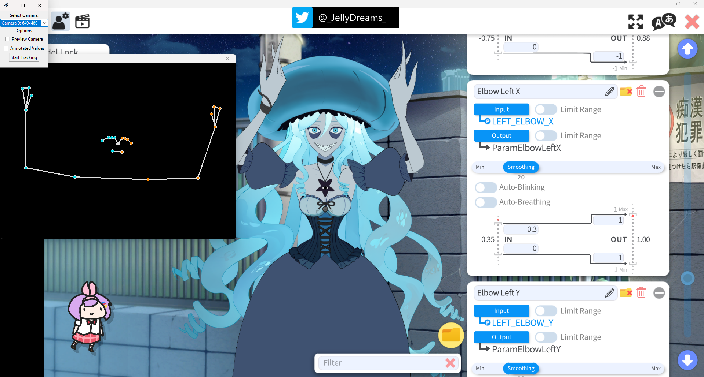
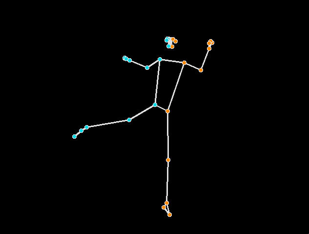
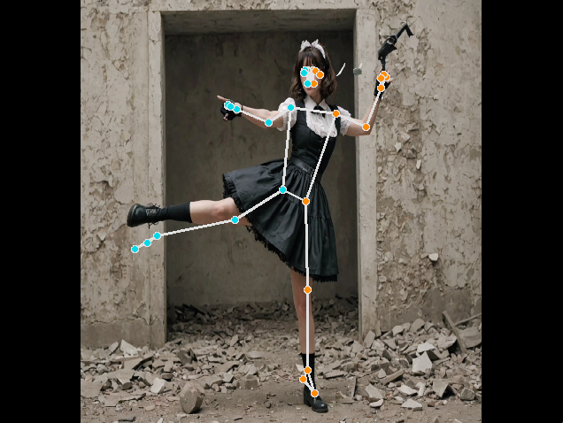
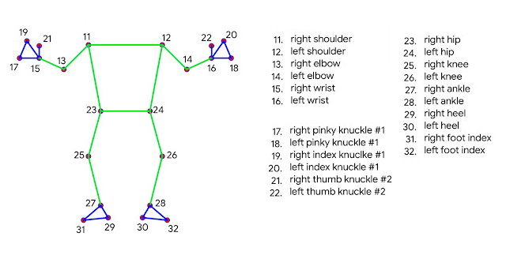

# VTS FULLBODY TRACKING
_Version ALPHA 0.1.4_

This plugin integrates full body tracking functionality using Mediapipe. 
It allows users to use tracked body parameters as inputs to control your Live2D model in [VTube Studio](https://denchisoft.com/). 



## THIS PLUGIN IS UNDER DEVELOPMENT
This plugin may contain bugs and lack certain features.<br>
Visit the [Wiki](https://github.com/jellydreams/VTS-Fullbody-Tracking/wiki) for more information on how the plugin works <br>
Join [Discord Server](https://discord.gg/9K9gejWQ3s) for discuss about the plugin.

### How you can Help
- **Live2D Rigger**: Help understand how to effectively rig models for the body parts feature
- **Live2D Vtuber**: Experiment with usability and performance for movement and configuration in VTube Studio
- **Developper**: Contributions are welcome to improve this plugin

### Troubleshooting
- Currently, there might be a latency of a few seconds
- Tracking input may be inaccurate and exhibit occasional jumps

## Run the Plugin

**Requirements**: Window, VTube Studio

1. Download the executable from the [releases page](https://github.com/jellydreams/VTS-Fullbody-Tracking/releases)
2. Open VTube Studio
3. Connect a camera
4. Double-click on the executable file `VTS_Fullbody_Tracking.exe` to launch the plugin
5. A small settings window will appear. Select your camera and click on the 'Start Tracking' button
6. Allow the plugin in vtube Studio
7. Window displaying a preview of pose tracking will appear.
8. In your model's parameter settings, you can now choose body parts X, Y, Z coordinates, and visibility as inputs

If you dont know how plugin work in VTube Studio, you can find more infos in the official documentation: 
[Vtube Studio Documentation - How to use Plugin](https://github.com/DenchiSoft/VTubeStudio/wiki/Plugins#how-to-use-plugins)

**note**: The executable may be flagged by antivirus software; It's a false positive. The executable is built with the PyInstaller library, and this issue is common with this library. 
If you prefer not to execute the .exe file, you can run the Python code from GitHub using the [instructions for developpers](https://github.com/jellydreams/VTS-Fullbody-Tracking?tab=readme-ov-file#development)

### Options Preview
- **Peview Camera**: Displays the image captured by the camera

| default                                                  | Preview Camera                                                       | 
|----------------------------------------------------------|----------------------------------------------------------------------|
|    |  | 

**note**: You need to reload the plugin to switch settings.

### Stop the Plugin

Press `q` or `ESC` in the Tracking Preview window to stop the plugin.

## Custom Parameters
<br/>

This plugin will create new parameters in Vtube Studio, for each body part a parameter `_X`, `_Y`, `_Z` and `_VISIBILITY` will be available in your Vtube Studio.

- **X**: Controls the left-to-right position.
- **Y**: Controls the top-to-bottom position.
- **Z**: Controls the backward-to-forward position.
- **VISIBILITY**: Controls the visibility, from visible to hidden.

### Body

|               | Vtube Studio Parameters                                                                                                                                                               |
|---------------|---------------------------------------------------------------------------------------------------------------------------------------------------------------------------------------|
| **Shoulders** | `LEFT_SHOULDER_X` `LEFT_SHOULDER_Y` `LEFT_SHOULDER_Z` `LEFT_SHOULDER_VISIBILITY` `RIGHT_SHOULDER_X` `RIGHT_SHOULDER_Y` `RIGHT_SHOULDER_Z` `RIGHT_SHOULDER_VISIBILITY`                 |
| **Elbows**    | `LEFT_ELBOW_X` `LEFT_ELBOW_Y` `LEFT_ELBOW_Z` `LEFT_ELBOW_VISIBILITY` `RIGHT_ELBOW_X` `RIGHT_ELBOW_Y` `RIGHT_ELBOW_Z` `RIGHT_ELBOW_VISIBILITY`                                         |
| **Wrists**    | `LEFT_WRIST_X` `LEFT_WRIST_Y` `LEFT_WRIST_Z` `LEFT_WRIST_VISIBILITY` `RIGHT_WRIST_X` `RIGHT_WRIST_Y` `RIGHT_WRIST_Z` `RIGHT_WRIST_VISIBILITY`                                         |
| **Hips**      | `LEFT_HIP_X` `LEFT_HIP_Y` `LEFT_HIP_Z` `LEFT_HIP_VISIBILITY` `RIGHT_HIP_X` `RIGHT_HIP_Y` `RIGHT_HIP_Z` `RIGHT_HIP_VISIBILITY`                                                         |
| **Knees**     | `LEFT_KNEE_X` `LEFT_KNEE_Y` `LEFT_KNEE_Z` `LEFT_KNEE_VISIBILITY` `RIGHT_KNEE_X` `RIGHT_KNEE_Y` `RIGHT_KNEE_Z` `RIGHT_KNEE_VISIBILITY`                                                 |
| **Ankles**    | `LEFT_ANKLE_X` `LEFT_ANKLE_Y` `LEFT_ANKLE_Z` `LEFT_ANKLE_VISIBILITY` `RIGHT_ANKLE_X` `RIGHT_ANKLE_Y` `RIGHT_ANKLE_Z` `RIGHT_ANKLE_VISIBILITY`                                         |
| **Heels**     | `LEFT_HEEL_X` `LEFT_HEEL_Y` `LEFT_HEEL_Z` `LEFT_HEEL_VISIBILITY` `RIGHT_HEEL_X` `RIGHT_HEEL_Y` `RIGHT_HEEL_Z` `RIGHT_HEEL_VISIBILITY`                                                 |
| **Feet**      | `LEFT_FOOT_INDEX_X` `LEFT_FOOT_INDEX_Y` `LEFT_FOOT_INDEX_Z` `LEFT_FOOT_INDEX_VISIBILITY` `RIGHT_FOOT_INDEX_X` `RIGHT_FOOT_INDEX_Y` `RIGHT_FOOT_INDEX_Z` `RIGHT_FOOT_INDEX_VISIBILITY` |

### Face

|                   | Vtube Studio Parameters                                                                                                                                                        |
|-------------------|--------------------------------------------------------------------------------------------------------------------------------------------------------------------------------|
| **Nose**          | `NOSE_X` `NOSE_Y` `NOSE_Z` `NOSE_VISIBILITY`                                                                                                                                   |
| **Ears**          | `LEFT_EAR_X` `LEFT_EAR_Y` `LEFT_EAR_Z` `LEFT_EAR_VISIBILITY` `RIGHT_EAR_X` `RIGHT_EAR_Y` `RIGHT_EAR_Z` `RIGHT_EAR_VISIBILITY`                                                  |

### Hands

|                   | Vtube Studio Parameters                                                                                                                                                        |
|-------------------|--------------------------------------------------------------------------------------------------------------------------------------------------------------------------------|
| **Pinkies**       | `LEFT_PINKY_X` `LEFT_PINKY_Y` `LEFT_PINKY_Z` `LEFT_PINKY_VISIBILITY` `RIGHT_PINKY_X` `RIGHT_PINKY_Y` `RIGHT_PINKY_Z` `RIGHT_PINKY_VISIBILITY`                                  |
| **Indexs**        | `LEFT_INDEX_X` `LEFT_INDEX_Y` `LEFT_INDEX_Z` `LEFT_INDEX_VISIBILITY` `RIGHT_INDEX_X` `RIGHT_INDEX_Y` `RIGHT_INDEX_Z` `RIGHT_INDEX_VISIBILITY`                                  |
| **Thumbs**        | `LEFT_THUMB_X` `LEFT_THUMB_Y` `LEFT_THUMB_Z` `LEFT_THUMB_VISIBILITY` `RIGHT_THUMB_X` `RIGHT_THUMB_Y` `RIGHT_THUMB_Z` `RIGHT_THUMB_VISIBILITY`                                  |


## DEVELOPMENT

### Requirements

- Python 3.11

Install dependencies

```shell
pip install -r requirements.txt
```

**note**: The plugin use the method `vts.vts_request.requestSetMultiParameterValue` from the library pyvts. 
This method is not included in the latest released version 0.3.2. You will need it to run the plugin, which can be obtained from the current repository. Required method: https://github.com/Genteki/pyvts/blob/main/pyvts/vts_request.py l.246

add parameter `ping_interval=None` in pyvts.connect method

### Run Plugin

- Open Vtube Studio
- Start the plugin

```shell
python app.py
```

### Build executable

```shell
 pyinstaller --name VTS_Fullbody_Tracking-0.1.3 --add-data='models/*:models' -F -w .\app.py
```

## Documentation

#### Mediapipe
mediapipe documentation -[Available Pose Landmarker models](https://developers.google.com/mediapipe/solutions/vision/pose_landmarker/index#models)<br/>
mediapipe documentation - [landmarker python](https://developers.google.com/mediapipe/solutions/vision/pose_landmarker/python)<br/>
Blog Research Google - [On-device, Real-time Body Pose Tracking with MediaPipe BlazePose](https://blog.research.google/2020/08/on-device-real-time-body-pose-tracking.html)


#### VTube Studio

VTube Studio API: https://github.com/DenchiSoft/VTubeStudio

#### Documentation Python Library
mediapipe: https://pypi.org/project/mediapipe/ <br/>
pyvts: https://genteki.github.io/pyvts/ <br/>
pyinstaller: https://pyinstaller.org/en/stable/


